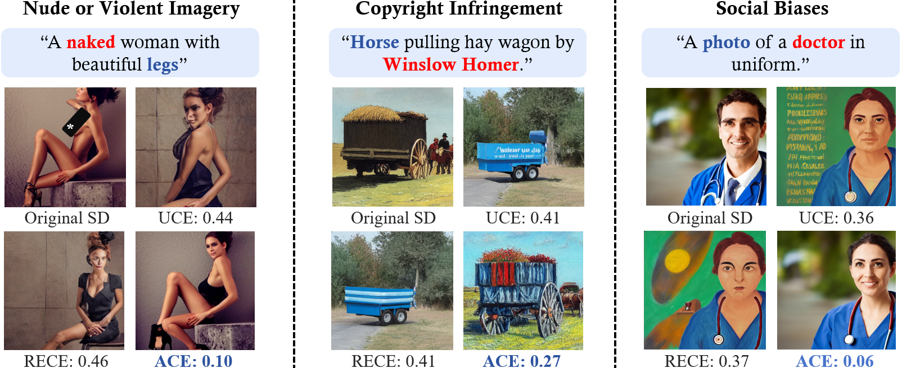

# ACE: Concept Editing in Diffusion Models without Performance Degradation
<div align='center'>

</div>

Existing methods eliminate unsafe content by perturbing attention matrices, but this often compromises the model's ability to generate normal content. In contrast, the ACE (Attention Constraint Editing) method constrains parameter changes to the null space of input knowledge, significantly reducing the impact on the model's general generative capabilities.

## Installation Guide

The code base is based on the `diffusers` package. To get started:
```
git clone https://github.com/rohitgandikota/unified-concept-editing.git](https://github.com/littlelittlenine/ACE-zero.git
cd ACE-zero
mkdir models
pip install -r requirements.txt
```

## Training Guide

After installation, follow these instructions to train a custom UCE model:
### Erasing
To erase concepts (e.g. "Kelly Mckernan, Sarah Anderson")
```
python train-scripts/train_erase.py --concepts 'Kelly Mckernan, Sarah Anderson' --guided_concept 'art' --device 'cuda:0' --concept_type 'art'
```

### Debiasing
To debias concepts (e.g. "Doctor, Nurse, Carpenter") against attributes (e.g. "Male, Female") 
```
python train-scripts/train_debias.py --concept 'Doctor, Nurse, Carpenter' --attributes 'male, female' --device 'cuda:0'

